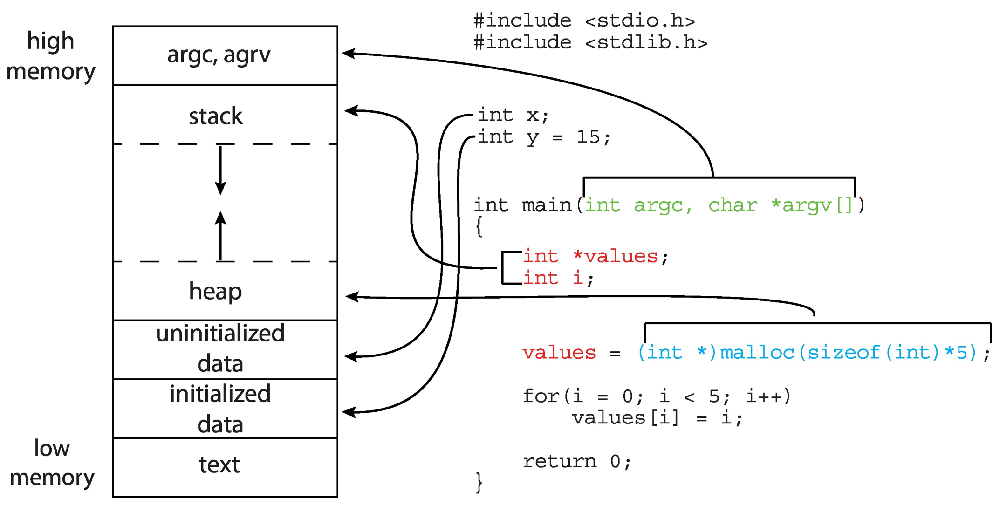
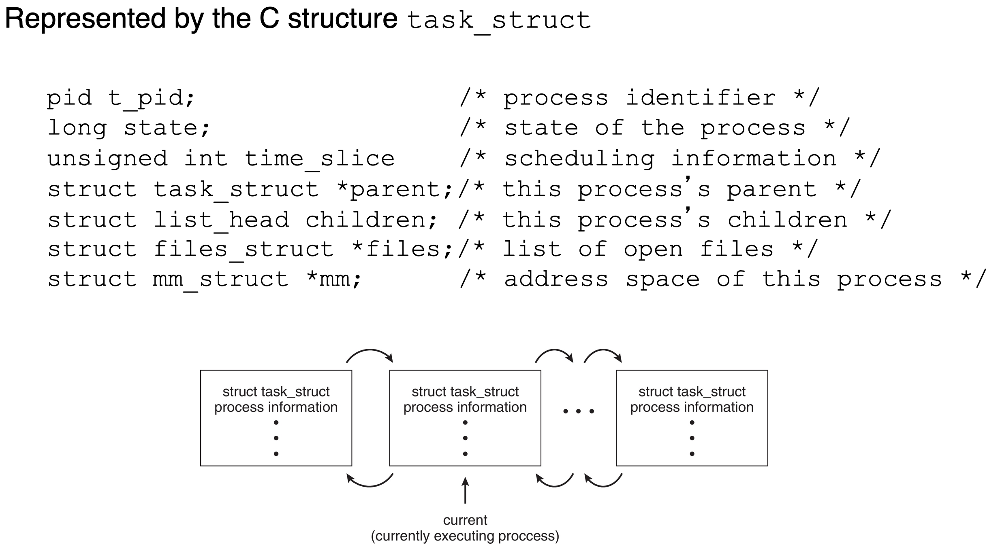

# Operating System Notes

return in main is return_group

when exit, close all the resources.

## Process Management

### Program structure



1. Text section: code.

2. Data section: initialized data

3. bss section: uninitialized data

4. head

5. stack

### Process state

New, Ready, Running, Waiting, Terminated.

Notice: There is zombie state in Linux.

### Process Control Block

A.k.a Task Control Block

1. Process state – running, waiting, etc
2. Program counter – location of instruction to next execute
3. CPU registers – contents of all process-centric registers
4. CPU scheduling information - priorities, scheduling queue pointers
5. Memory-management information – memory allocated to the process
6. Accounting information – CPU used, clock time elapsed since start, time limits
7. I/O status information – I/O devices allocated to process, list of open files

Notice: This assumes one thread per process. There should be thread details.



### Process Scheduling

Scheduling queues:

Ready queue: all process in memory that is ready to run

Wait queue: all process in memory waiting for an event

- Context switch: interrupt or system call -> save state to PCB -> load state from another PCB

### Process Termination

1. The process executes last statement, and OS delete it by exit() system call.

2. Parent may terminate child using abort().

3. Cascading termination: Some OS terminate child if parent is terminated.

4. Parent can wait for termination of child. If no parent waiting

## Inter Processes Communication (IPC)

Chrome has 3 type of processes: Browser, Renderer, Plug-in processes.

- Two models of IPC: shared memory, message passing

- Independant processes cannot be affected by the execution of other processes.

### Pipe

- Pipe is a unidirectional communication method, implemented by file descriptors.

- One process write to a pipe, one process read from pipe.

- Notice parent and child can be at both side of pipe.

- Use pipe should carefully close file descriptor:

- fd[0] is input (take data from pipe), fd[1] is output (put data input pipe)

```C
int fd[2];
pipe(fd);
pid = fork();
if (pid == 0) {
  close(fd[0]);
  write(fd[1], ...);
} else {
  close(fd[1]);
  read(fd[0], ...)
}
...
if (pid == 0) {
  close(fd[1]);
} else {
  close(fd[0]);
}
```

- Duplicate pipe to standard input:

```C
childpid = fork();

if(childpid == 0) {
  /* Close up standard input of the child */
  close(0);
  
  /* Duplicate the input side of pipe to stdin */
  dup(fd[0]);
  execlp("sort", "sort", NULL);
}
```

- `dup2` can duplicate from x to y. (x is closed).

- File discriptors are specific to process. There is no global open file list, just a list each process opened.

### 

- Multiple processors make possible multiple process running at the same time. Single processor running state machine: process creator -> create a process -> put to run queue -> CPU select one process to run from run queue -> process running -> CPU schedule the process -> process blocked/sleeped
running -> zombie -> terminate

- zombie: Cannot run but not cleared. OS still retain the information of that process.

```c
if(p = fork() > 0) wait(); // parent wait for child
else exit(0); // child exit
```

- signal: Receive SIG_KILL, the process is required to exit. But most processes don't explicitly call exit. What happens in OS is housing keep. In interrupt, kernel code first check pending signals.

- signal's difference with interrupt: interrupt is generated by pure hardware. Signal is produced by software codes.

- There is a interrupt table register in CPU, the address of table in RAM.

## Daemon

When a traditional SysV daemon starts, it should execute the following steps as part of the initialization. Note that these steps are unnecessary for new-style daemons (see below), and should only be implemented if compatibility with SysV is essential.

1. Close all open file descriptors except standard input, output, and error (i.e. the first three file descriptors 0, 1, 2). This ensures that no accidentally passed file descriptor stays around in the daemon process. On Linux, this is best implemented by iterating through /proc/self/fd, with a fallback of iterating from file descriptor 3 to the value returned by getrlimit() for RLIMIT_NOFILE.

2. Reset all signal handlers to their default. This is best done by iterating through the available signals up to the limit of _NSIG and resetting them to SIG_DFL.

3. Reset the signal mask using sigprocmask().

4. Sanitize the environment block, removing or resetting environment variables that might negatively impact daemon runtime.

5. Call fork(), to create a background process.

6. In the child, call setsid() to detach from any terminal and create an independent session.

7. In the child, call fork() again, to ensure that the daemon can never re-acquire a terminal again. (This relevant if the program — and all its dependencies — does not carefully specify `O_NOCTTY` on each and every single `open()` call that might potentially open a TTY device node.)

8. Call exit() in the first child, so that only the second child (the actual daemon process) stays around. This ensures that the daemon process is re-parented to init/PID 1, as all daemons should be.

9. In the daemon process, connect /dev/null to standard input, output, and error.

10. In the daemon process, reset the umask to 0, so that the file modes passed to open(), mkdir() and suchlike directly control the access mode of the created files and directories.

11. In the daemon process, change the current directory to the root directory (/), in order to avoid that the daemon involuntarily blocks mount points from being unmounted.

12. In the daemon process, write the daemon PID (as returned by getpid()) to a PID file, for example /run/foobar.pid (for a hypothetical daemon "foobar") to ensure that the daemon cannot be started more than once. This must be implemented in race-free fashion so that the PID file is only updated when it is verified at the same time that the PID previously stored in the PID file no longer exists or belongs to a foreign process.

13. In the daemon process, drop privileges, if possible and applicable.

14. From the daemon process, notify the original process started that initialization is complete. This can be implemented via an unnamed pipe or similar communication channel that is created before the first fork() and hence available in both the original and the daemon process.

15. Call exit() in the original process. The process that invoked the daemon must be able to rely on that this exit() happens after initialization is complete and all external communication channels are established and accessible.

The BSD daemon() function should not be used, as it implements only a subset of these steps.

A daemon that needs to provide compatibility with SysV systems should implement the scheme pointed out above. However, it is recommended to make this behavior optional and configurable via a command line argument to ease debugging as well as to simplify integration into systems using systemd.