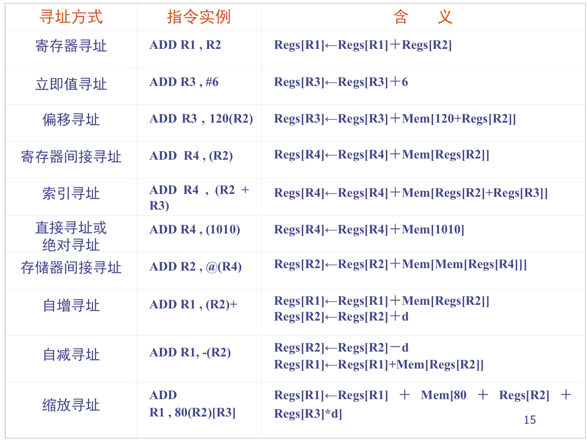
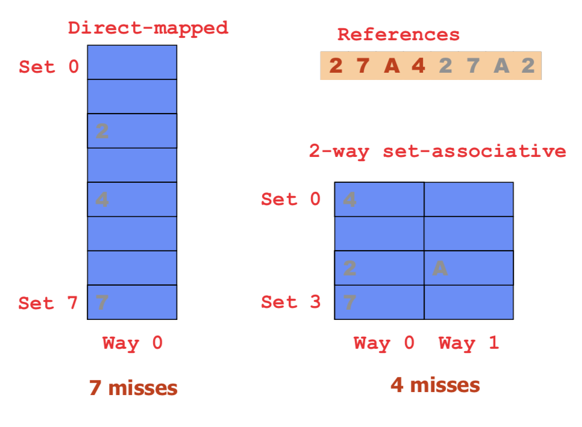
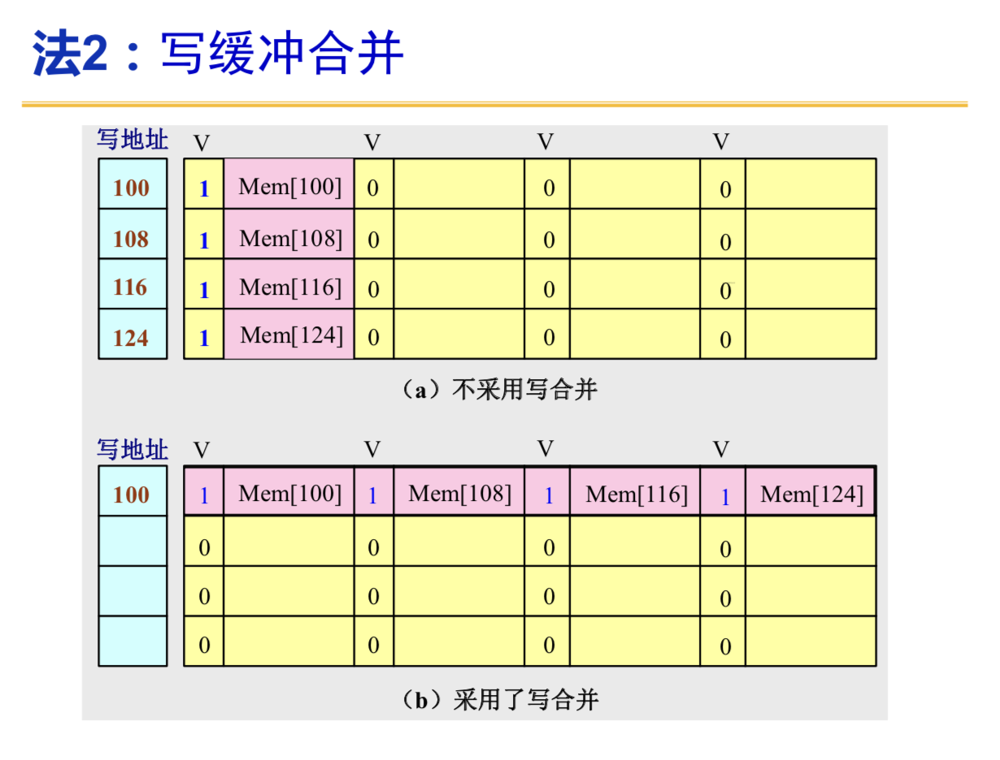
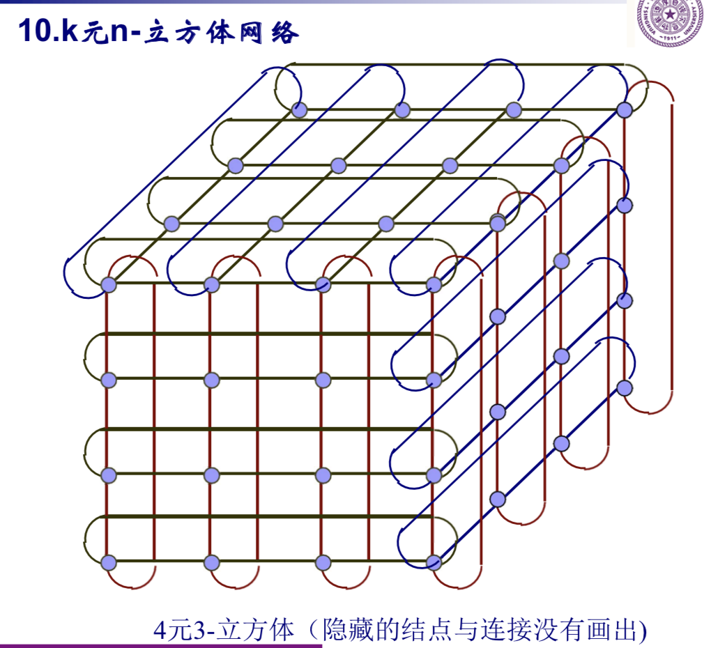
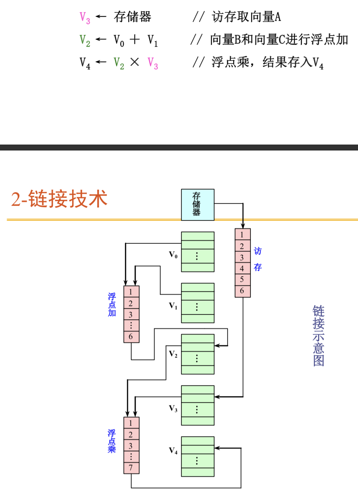

# 计算机系统结构

## CH 1: 指令体系

寻址方式：指令系统中如何形成所要访问的数据的地址

寻址方式可以指明指令中的操作数是一个常数、一个寄存器操作
数或者是一个存储器操作数。

指令长度：最佳编码长度huffman编码。

等长扩展码：由有限几位固定长度的码长，例如2-4扩展码是按照由高到低的频率给予2或4的长度

地址码的优化（都是指的内存，一般没有寄存器）

三地址码：普通

二地址码：通常需要先MOVE一下，然后每次计算的结果都保存在其中一个操作数种

一地址码：结果保存在一个累加器中

零地址码：借助堆栈完成。两个操作数取自栈顶

多寄存器结构的二地址：相当于进阶版的累加器

需要统计：指令条数，访存次数，程序存储量（指令条数x操作码长度+地址个数x指令条数x地址码长度），执行速度（访存信息量）

### CISC

对大量的目标程序及其执行情况进行统计分析，找出 那些使用频度高、执行时间长的指令或指令串。对于 使用频度高的指令，用硬件加快其执行;对于使用频 度高的指令串，用一条新的指令来替代

## CH 2: Cache设计

组相连：组是映射的，组内是全相连的。

n路组相连：每组中有n个块（这是全相连的）

### Cache Miss & Replace

- Compulsory miss or Cold miss. 第一次访问。

- Measure: number of misses in an infinite cache model

- Capacity miss. Working set exceeds cache capacity

- Useful blocks (with future references) displaced

- Good replacement policy is crucial!

- Measure: additional misses in a fully‐associative cache

- Conflict miss

- Placement restrictions (not fully‐associative) cause useful blocks
to be displaced

- Think of as capacity within set

- Good replacement policy is crucial!

- Measure: additional misses in cache of interest

Binary Tree: 将寻址方式变成一颗二叉树，树中节点是一个0/1 bit，表示左边还是右边更新（最新被访问过），然后访问的时候反转bit，并进行寻址

### Cache 写策略

写必须在确认命中以后才可以进行。

写可能导致cache和主存内容不一致

1. 写直达：不仅写入cache，也写入下一级

2. 写回：只写入cache，只有替换的时候才写回主存

面向写通过的写缓冲：

CPU不用停顿，RAW问题需要排空缓冲区，或者检查写缓冲区后再进行读操作。

写缺失时候的处理：

1. 写分配：先将所需但愿掉入cache，然后再进行写入

2. 写绕过：直接写入下一级存储器而不调块

写回法 ── 写分配

写直达法 ── 写绕过

## CH 4: 改进Cache

### 降低缺失率

1. 增加Cache块大小。

给定Cache容量，随着cache块增大，缺失率先小后大。

原因：

- 减少了强制性缺失

- 减少Cache中块的数目，所以有可能会增加冲突缺失。

还会增加缺失损失

2. 增加Cache容量

缺点：

- 增加成本

- 增加命中时间

注：在片外（芯片外）Cache中常用

3. 提高相连度

相连度越高，冲突缺失越少

优点：

提高了相连度，减少了冲突缺失

缺点：

- 增加命中时间

- 相连度超过8意义不大

4. 伪相连Cache

将Cache分为两部分，一部分按照直接映射，另一部分按照全相连。首先在直接映射上找命中，不明中在全相连中找，再不明中就是miss

缺点：

多种命中时间，不能用于1级cache，需要多级cache配合

5. Victim Cache

增加一个全相连的小Cache，存在被替换出去的块

对于小容量的全相连Cache提升显著

6. 硬件预取

指令和数据都可以预取

指令流缓冲器

利用存储器的空闲带宽，不能占用对于正常缺失的处理，否则会降低性能。

7. 编译器控制的预取

寄存器预取或者是cache预取

故障预取或者非故障预取（若出现虚地址故障或违
反保护权限，就会发生异常）

循环是预取优化的主要对象

每次预取需要花费一条指令的开销

8. 编译器优化

- 数组合并

- 内外循环交换

- 循环融合

- 分块：把对数组的整行或整列访问改为按块进行

### 降低缺失损失

1. 读缺失优先于写

在读缺失时，所读单元的最新值有可能还在写
缓冲器中，尚未写入主存

推迟对读缺失的处理

在写回法Cache中，也可采用写缓冲器

2. 写缓冲合并

提高写缓冲器的效率

如果写缓冲器中已经有了待写入的数据，就要把 这次的写入地址与写缓冲器中已有的所有地址进 行比较，看是否有匹配的项，如果有地址匹配而对应的位置又是空闲的，就把 这次要写入的数据与该项合并。

3. 请求字处理技术

从下一级存储器调用的块中，只有一个字是立即需要的，应该今早把请求字发送给CPU

- 尽早重启动: 调块时，从块的起始位置开始读起。 一旦请求字到达，就立即发送给CPU，让CPU继续执行。

- 请求字优先: 调块时，从请求字所在的位置读起。 这样，第一个读出的字便是请求字。将之立即发送给CPU。

这种技术在以下情况下效果不大:

 Cache块较小

 下一条指令正好访问同一Cache块的另一部分

4. 非阻塞Cache技术

Cache缺失时仍允许CPU进行其它的命
中访问，而不是阻塞CPU进行Cache载入和替换。即允许“缺失下命中”。

一次缺失下命中就几乎可以得到所有的好处

5. 采用两级Cache

评价第二级Cache时，应使用全局缺失率这个指标

### 降低命中时间

1. 容量小、结构简单的Cache

2. 虚拟Cache

使用虚拟地址进行访问的cache，减少了虚实地址转换的时间

问题是清空（进程死亡，切换）

解决方法是在地址标志中加入PID字段

3. Cache访问流水化

4. 写更好的代码

Address Aliasing

## CH 5: 并行主存

能在一个访存周期内并行访问多个存储字的存储器，能有效提高带宽。

### 单体多字存储器

将一个单体m字的存储器平分成n分，这样带宽提高到了原来的m倍。

优点：简单

缺点：访存效率低，实际带宽比最大带宽小

1. 取指令冲突（分支前后指令）

2. 读操作数冲突：一次独处的数据不一定有用，当前指令需要的多个操作数不一定恰好放在同一个长存储字中

3. 写数据冲突

4. 读写冲突

### 多体交叉存储器

多个单体，每个有自己的地址寄存器和译码/读写驱动电路

#### 编址问题

高位交叉/地位交叉

1. 高位交叉

同一个体中的高位是相同的

第i行第j列的单元，即体号为j、体内地址为i 的单元，其线性地址为A = j x n + i

能够扩大容量。

2. 低位交叉

能够提高访问速度

## CH 6 流水线技术

- 流水线的基本概念基本概念

- 流水线的量化分析

- 非线性流水线的调度

- 流水线的相关与冲突

### 基本概念

- 流水线把一个处理过程分解为若干个子过程(段),每个子过程由一个专门的功能部件来实现。

- 流水线适用于大量重复的时序过程

- 流水线应用于操作符运算，称为部件级别流水线

- 应用于指令执行的过程，称为处理器级别流水线（指令流水线）

- 多台处理器串行链接，每个处理器完成一个功能，称为系统级流水线（宏流水线）

- 时间最长的段将成为流水线的瓶颈。

- 流水线每一个段（级）的后面都要有一个缓冲寄存器(锁存器),称为流水寄存器。作用:在相邻的两段之间传送数据，以保证提供后面要用到的信息，并把各段的处理工作相互隔离。

- 通过时间:第一个任务从进入流水线到流出结果
所需的时间。

- 排空时间:最后一个任务从进入流水线到流出结
果所需的时间。

- 静态、动态流水线；线性，非线性流水线（有反馈）；顺序、乱序流水线（先进入的任务不一定先完成）；标量处理和向量处理流水线

### 量化分析

#### 吞吐率

单位时间内完成的任务数量 $TP = \frac{n}{T_k}$

一个k段线性流水线连续完成n个任务：$T_k = k \Delta t + (n-1) \Delta t$。实际吞吐率用这个进行计算，最大吞吐率取极限，$\frac{1}{\Delta t}$

各段时间不相等的流水线，按照瓶颈段进行排列，加上一个任务的完整长度即可。

解决瓶颈问题的常用方法：细分瓶颈段，重复设置瓶颈段

#### 加速比

同样一批任务，使用流水线的时间的加速比。

#### 效率

流水线中设别实际使用时间和运行时间的比值。

1. 各段流水线时间相等：$\frac{n}{n+k-1}$

2. 各段流水线时间不相等：按照不相等的时间计算

#### 性能分析

注意：静态流水线中不存在调度。比较死板。流水线的工作过程有建立和排空的部分。

动态流水线中的调度也应该是尽量让同一个流水线连续执行。

流水线的额外开销：流水线寄存器延时，时钟偏移

### 非线性流水线

- 启动距离：非线性流水线中输入端连续输入两个任务之间的时间间隔。

- 禁用启动距离：会引起流水线功能段冲突的启动距离

- 目的：找出一个最小循环周期，使得按照这个周期输入任务，不会导致冲突。

- 预约表：某一个时间段使用一个部件的图。

#### 非线性流水线冲突调度

1. 禁止启动集合：预约表中两个x的距离，表示这个距离启动造成冲突。

2. 冲突向量：从左到右从高到低排列，冲突就设成1.

第二个任务间隔j个时钟周期流入，此时禁止集合中的数字应该减去j，即是右移对应j位。新的冲突向量是两个或起来。

一般情况：$C_k$是当前的冲突向量，j是下一个任务距离当前的时间间隔，那么：

$C_{k+1} = SHR^{(j)}(C_k) or C_0$

中间向量进行对应的位移，然后和初始向量或在一起。

- 流水线状态转移图：通过有向弧和数字表示位移的大小和结果。

- 一张预约表对应一张状态图，但是不同的预约表可能右相同的状态图

- 简单循环：状态图中哥哥冲突向量只经过一次的启动循环。

- 每一个简单循环可以有一个平均启动距离。

- 恒定循环：一个数字

#### 优化调度方法

- 下限是预约表中任意行中x最多的个数

- 小于等于任意一个简单循环的平均启动距离

- 最小平均启动距离的上限是冲突向量中1的个数再加上1

预留算法：

1. 确定最小平均启动距离。

2. 最小启动循环。（一般是恒定循环）

3. 通过插入非计算延迟段（修改预约表）实现最小启动循环。

### 流水线冲突

保证在同一个时钟周期不会要求同一个功能段做两件不同的工作。

ALU不能同时进行有效地址计算和算数运算，IF和MEM的访存不能冲突，ID和WB要访问同一个寄存器。

- 相关：两条指令存在依赖关系。

#### 流水线的相关

1. （i和j）数据相关：j使用i的结果；j与k相关，k与i相关。

2. 名相关：j读和i写的相同，则i和j发生了反相关。输出相关：i和j写的是相同的。明相关的两条指令之间没有数据的传送，一条指令中的名改变了，并不影响另一条的执行。

换名：通过改变操作数的名来消除相关。

3. 控制相关：由分支指令引起的相关。

#### 流水线的冲突

1. 结构冲突：硬件资源满足不了指令同时执行的需要

2. 数据冲突：重叠执行的时候，后面的指令用到了前面的结构

3. 控制冲突：分支指令等其他改变PC值的冲突

后果：

1. 错误的执行

2. 流水线停顿

注意：一条指令被暂停的时候，之后所有的指令都要暂停，之前的指令则继续执行

1. 访存冲突：插入旗袍，或设置独立的指令、数据cache

2. WAW冲突：流水线中有多个段可以进行写操作，或者指令呗重新排序了。

3. WAR：写操作结果提前了，或者指令被重新排序了。

通过定向技术（旁路）减少冲突引起的停顿。在计算结果尚未出来的时候，后面等待使用该结果的指令并不真正立即需要该计算结果，如果能够将该计算结果从其产生的地方直接送到其它指令需要它的地方，那么就可以避免停顿。

4. 控制冲突：分支指令的执行结果是成功和不成功。

- 简单方法：排空流水线

- 由分支引起的延迟是分支延迟

分支延迟指令的调度：

通过插入NOP指令可以放置冲突，将延迟槽的指令替换为有用指令：

1. 从前调度：被调度的指令必须与分支无关

2. 从目标调度：必须保证分支失败的时候，指令执行不会错误，有可能复制指令。分支成功时起作用

3. 从失败调度：类似。

## CH 7 动态流水线

为了支持乱序执行，5段流水线的译码阶段再分为两个阶段:

1. 流出(Issue，IS): 指令译码，检查是否存在 结构冲突。 (in-order issue)

2. 读操作数(Read Operands，RO): 等待数据冲 突消失，然后读操作数。（out of order execution）

### 计分牌

#### IS

1. 检测 **结构相关**，或者 **WAW相关**。如果有则暂停当前，也不发射后面，直到相关解除

2. 如果未检测到冲突，而且 **当前功能空闲**，则发射指令

#### RO

1. 检测数据相关，没有（已发射的指令不对当前指令的源寄存器操作）则读操作数

#### EXE

得到操作数后，功能不减开始执行

#### WB

执行完毕，检测WAR相关。如果有就暂停。

### Tomasulo

每一次新的指令进入一个队列中（如果没有结构冲突），每次从队列中取出一个指令。

Reservation Station记录这条指令的op，原操作数，原操作数的FU，并将目的数重命名，存在Register clock里。

### 动态分支预测

1. 分支历史表BHT：1/2位

前述5段经典流水线：由于判定分支是否成功和计算 分支目标地址都是在ID段完成，所以BHT方法不会给 该流水线带来好处。

2. 分支目标缓冲器BTB

将分支成功的PC值和对应的目标地址写入BTB中，作为一项。

如果按照该项进行指令预取，分支成功，则保留。执行的时候不会出现停顿。

预取后分支失败，则删除这一项。

3. 基于硬件的前瞻执行

对分支指令的结果进行预测，并假设总是对的，进行指令执行，结果写入再定序缓冲器(ROB)中，指令得到commit以后才写入寄存器。

通过Tomasulo的扩充：写结果和指令确认可以完成ROB.

写结果：先写入ROB中，在CDB上传送结果。

确认：分支指令的结果出来以后，对前瞻执行进行确认。如果猜测是正确的，就写入寄存器；不正确就从另一条分支路径开始执行。

ROB的构成：

- 指令类型：分支、load、store

- 目的地址：执行结果应该写入的寄存器号

- 数据值：保存结果

- 就绪字段：是否完成执行

## CH 8:互连网络

针对于集群或者计算机内部的链接。

由开关原件按照一定拓扑结构和控制方式构成的网络。

操作方式：

1. 同步

2. 异步

交换方式：

1. 电路交换L物理通路在数据传送之间保持连接

2. 分组交换：消息奉承包，送入互连网络

3. 蠕虫(wormhole)交换：打成多个段

### 静态网络

链路无源

开关元件通过处理器链接

不直接相连的通信需要通过中间节点中转。

链接方式不会改变

#### 指标

1. 节点度：入度+出度

2. 距离：两个节点之间相连的最少边数

3. 【考点】网络直径：网络中任意两个节点距离的最大值

4. 网络规模：节点数

5. 等分宽度：（节点数差值$\le 1$）切口的最小边数称为等分宽度。

6. 对称性：从任何节点看，拓扑结构都一样，这样的网络实现是容易的。

7. 节点是否同构。

8. 通道是否有缓冲。

#### 典型静态网络

1. 线性阵列。

N个节点，N-1个链路，直径是N-1，度为2（不考虑边缘的度为1）。

N很大时，通信效率低。

* 总线：总线是独占的，而线性阵列允许同时通信。

2. 环。

单项环：

双向环：直径$[\frac{N}{2}]$。因为可以向左/向右走，走最短的那条。

3. 带弦环

环上面链接了弦。

链路数：点数乘以度数除以2.

4. 全联通（链接）

带弦环的特殊情况。

5. 树形

由于节点度为常数，所以树是一个可扩展的系统。

完全二叉树$N = 2^K - 1$

直径$2(K-1)$

一个问题是根结点负担太重：环形树，二叉胖树（度在变化，不好）

6. 星形

实际上是一个二层树。

N-1条链路，直径是2，不对称，等分宽度$[\frac{N}{2}]$。

7. 网格形

N个节点的$r\times r$网格。

有$2(N-r)$条链路，是行和列加起来。

直径是$2(r-1)$，左上到右下。

非对称，等分宽度偶数是r，奇数是r+1。

扩展：Illiac 网络

一个度为4的带弦环

2N条链路，直径是r-1，节点度为4

扩展：环形网络

直径$2[\frac{r}{2}]$，节点度4，对称。

8. 超立方体

N-立方体有$2^N$个节点。

直径是N

9. 带环超立方体

每个结点环是 一个有n个结点的环

10. k元n-立方体

每一面是一个$k \times k$的环形网络。

K进制的数可以用来表示地址。

传统环型网络等于4元2-立方体。

### 动态网络

【不需要死记硬背具体的数字】

1. 恒等函数

2. 方体函数

$cube_k$表示把第k位的二进制数取反。

3. 洗牌函数

循环左移。

变形：均匀洗牌

洗牌函数和$cube_0$的结合。

变形：子洗牌（最低的k+1位循环左移）

变形：超洗牌（高位的k-1位循环左移）

4. 逆洗牌

循环右移。

5. 蝶式

最高位和最低位互换。

6. PM2I函数（加减$2^i$）

加的时候：加$2^i$后取模。

从左向右排列，遇到括号回来。

#### 多级互联网络

直送，上播，下播……

级间互联模式。

级控制：没级只有一个控制信号：最简单

每一个开关一个控制：最灵活

部分级控制：几个开关合用一个控制函数。

修改每一个按钮的状态，但是不能改显得状态。

1. $\Omega$网络：洗牌网络加上恒等网络。

并不是所有的置换都可以一次通过。

出现阻塞的时候，可以采用几次通过的方式。

可以实现广播。

3. 蝶式网络，不允许广播

### 通信问题

#### 基本指标

1. 消息分成多个包，每一个包若干个片。

3. 传输延迟

一个消息的延迟，和一个网路的延迟

吞吐量：单位时间内，网络传输的消息量。

4. 传输延迟的公式

建立延迟 + 网络延迟 + 阻塞延迟

* 建立：和机器本身的技术有关。可以分为源节点和目的节点延迟。

* 网络：$T_p \times D + \frac{L}{B}$

节点延迟 + 线路延迟

D：中间节点数

$\frac{L}{B}$线路时延。

#### 路由算法

最短路/非最短路

确定性/非确定性

1. 存储转发

A把整个消息存储下来。

缺点是对于内存需求较大，而且

2. 虚拟直通

消息来一点，就开始进行路由选择。

$\frac{L_h D + L}{B}$

当统辖下一个节点的通道忙，或者是节点缓冲器非空闲时，退化到存储转发。

3. 线路开关/线路交换

4. wormhole交换

## CH 9: vector processor

向量平衡点: 为了使向量硬件设备和标量硬件设备的利用率相等，一个程序中向量代码所占的百分比

## CH 10: 阵列处理机

一个由多个处理单元构成的阵列

SIMD计算机

横向处理：不适合向量机

纵向（垂直）处理：适合向量机，但是长度受向量寄存器限制

纵向（分组）处理：适合向量机，且长度不受限制

向量寄存组V

- 由512个64位的寄存器组成，分成8块。

- 编号:V0~V7

- 每一个块称为一个向量寄存器，可存放一个长度
(即元素个数)不超过64的向量。

- 每个向量寄存器可以每拍向功能部件提供一个数据元
素，或者每拍接收一个从功能部件来的结果元素。

- 标量寄存器S，有8个:S0~S7 64位

- 快速暂存器T，用于在标量寄存器和存储器之间提供缓
冲。

- 向量屏蔽寄存器VM，64位，每一位对应于向量寄存器的一个单元。作用:用于向量的归并、压缩、还原和测试操作、
对向量某些元素的单独运算等。

只要不出现Vi冲突和功能部件冲突，各Vi之间和各
功能部件之间都能并行工作，大大加快了向量指
令的处理。

- Vi冲突:并行工作的各向量指令的源向量或结果向量 使用了相同的Vi。

### 链接技术

两条向量指令占用功能流水线和向量寄存器的4种情况：

1. 指令不相关 例如:

V0←V1+V2

V6←V4*V5

这两条指令分别使用各自所需的流水线和向量寄存器，可以并行执行。

2. 功能部件冲突 例如:

V3←V1+V2 

V6←V4+V5

这两条指令都要使用加法流水线，发生了功能部件冲突(但向量寄存器不冲突)。

3. 源寄存器冲突 例如:

V3←V1+V2

V6←V1*V4

这两条向量指令的源向量之一都取自V1。由于两者的首元素下标可能不同，向量长度也可能不同，所以难以由V1同时提供两条指令所需要的源向量。这两条向量指令不能同时执行。只有等第一条向量指 令执行完、释放V1之后，第二条向量指令才能开始 执行。

4. 结果寄存器冲突

两条向量指令使用了相同的结果向量寄存器。例如:

V4←V1+V2 

V4←V3*V5

这两条指令都要访问目的寄存器V4。由于第一条指令在先，所以它先占用V4直到运算完成，然后再流出后一条指令。

* 当前一条指令的结果寄存器是后一条指令的源寄存器、 且不存在任何其他冲突时，就可以用链接技术来提高性能。

例如:

V3←V1+V2

V6←V3*V4

Cray-1中把向量数据元素送往向量功能部件以及把结果存入向量寄存器都需要一拍时间，从存储器中把数据送入访存功能部件也需要一拍时间。

链接示意图：

### 分段开采

当向量的长度大于向量寄存器的长度时，必须把 长向量分成长度固定的段，然后循环分段处理， 每一次循环只处理一个向量段。

这种技术称为分段开采技术，由系统硬件和软件控制完成，对程序员是透明的。

编队：同一个编队是可以并行或链接执行的。

总时间：

$T_n = [\frac{n}{MVL}] \times (T_{loop} + T_{start}) + mn$

n是向量元素个数，MVL是向量寄存器的长度，$T_{loop}$是loop overhead，$T_{start}$是开采指令的执行时间，m是编队的数量。

### 最大性能

性能 = 向量指令序列中浮点运算次数 × 时钟频率 / 执行指令序列所需的周期数

## Ch-12 多核Cache一致性

定义：同一个数据项在多个Cache和内存中不一致

### 引起不一致的因素

1. 写直达Cache的不一致

一个处理器更新了自己的cache和memory，但是旧的拷贝仍然存在在另一个处理器的cache中。

2. 写回的不一致

Proc 0: Update Cache。

Memory & Proc 1's Cache is outdated.

3. IO不一致

DMA（Direct Memory Access）修改了值，但是处理器的cache没有被更新。

### 一致性协议的设计思想

1. 没有处理器可以载入一个过时的数据：写入之后立刻更新或者无效化一些数据

2. 同一时刻只允许一个处理器写一个位置。（写序列化）

#### 什么时候应该通知其他的数据拷贝？

Cache State: Valid & Invalid

Op: Load & Store

Load Valid: not notify

Load Invalid: notify memory to fetch new data

Store Valid: notify other proccessors to invalidate or update

Store Invalid: notify others to return data and invalidate or update. （因为产生了一个更新的值）

#### 什么时候应该无效化其他拷贝？

1. Write invalidate:

写入共享数据：无效化其他

写直达：memory永远是最新的

写回：无效化内存中的数据

- 优点：对于一个处理器连续读写数据很好

2. Write update（broadcast）:

写入共享数据：更新其他

写直达：memory永远是最新的

- 优点：多个处理器同时读，写较少时性能好

#### 向谁发送请求？

1. Bus Snooping Protocol

对所有处理器发送请求

处理器监听是否有一个自己持有的copy需要被无效化和更新。

在小规模的机器上十分流行。

2. 基于目录的协议

分布式的目录。

通过点对点请求（网络结构）来通知对方处理器。

3. Token Protocol

每一个内存块被赋予了一些令牌。例如如果有T个processor，那么就有T个令牌。

当processor读的时候：它拿走内存块的一个令牌，读完了以后，它返回令牌。

当processor写的时候：它拿走内存块所有的令牌，写完了以后返回令牌。

当因为令牌个数不足没有办法读写的时候，产生一个request timeout，并提交一个永久请求。永久请求会被FIFO地解决和仲裁。

- 优点：可以和基于目录的协议中一样的一个没有方向网络，拥有和监听协议一样的低延时

### 监听协议的状态机

1. CPU本身对于已经在cache块内的数据进行读写

2. CPU本身对于不在cache块中的数据进行读写（首先进行了块替换）

3. 监听BUS信号对于cache数据的读写

### 目录协议的状态机

存储器、目录和cache处理器都是分布式的。

本地节点：发出请求的节点

宿主节点：包含所访问的存储单元与其目录的节点

远程节点：可以和宿主节点是同一个节点，也可能不是。

####  目录的三种结构

1. 全映像目录

每个目录都包含一个N位（对于每一个处理机）的向量。

优点：处理简单，速度快

缺点：存储空间的开销大。目录项目的数目也和处理器的个数成正比，一共是O(n2)的空间占用。因为是在硬件上直接存储，所以对空间要求很严格，可扩展性很差

当位向量中的值是1的时候，表示有一个副本。

2. 有限映像目录

提高扩展性和减少目录所占用的空间

采用位数固定的目录项，用二进制表示数据块在所有cache中的地址。

3. 链式目录

未缓冲: 该块尚未被调入Cache。所有处理器的
Cache中都没有这个块的副本。

共享: 该块在一个或多个处理机上有这个块的副本，且这些副本与存储器中的该块相同。

独占: 仅有一个处理机有这个块的副本，且该处 理机已经对其进行了写操作，所以其内容是最新的，而存储器中该块的数据已过时。

这个处理器是该块的拥有者。
