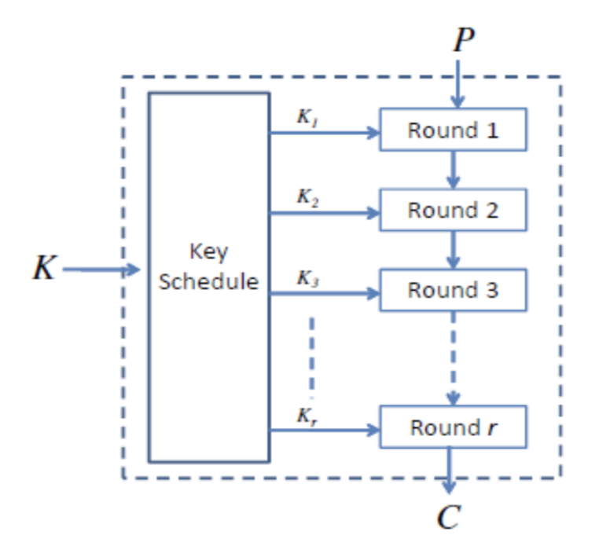
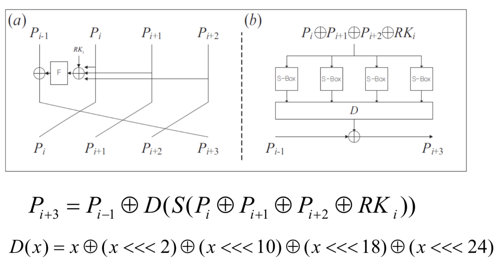

## 分组密码的设计

### 密码攻击方式

* cipher-text only attack

* C-P pair attack 已知明文攻击

* select plain-text attack 选择明文攻击：能够选择一个特定的明文，得到它的密文。比如说在保证一个密钥不变的情况下，提交消息并得到对应密文

* select cipher-text attack 选择密文攻击：能够得到一个特定密文对应的明文。

### 迭代结构

分组密码中的常见结构，便于设计、实现和安全性评估。

结构：

K通过一个策略形成「轮密钥」，然后在轮函数中进行加密。

#### 轮函数

##### 轮函数的设计策略

1. Confusion: 非线性部件。

* 小的代换表 - S-box

* 乘法、异或；加法、异或

2. 扩散：让所有的比特相互影响

* 线性变换

* 置换

* 以为、循环移位

##### 设计轮函数的方案

1. Feistel Network: DES中使用。

2. Substitution-Permutation Network (SPN)：AES中国使用。

#### 密钥方案（Key Schedule）

目前没有完美的方法。

基本准则：

每个密钥的bit应该影响不同位置的很多轮的轮密钥。

#### Feistel Network

##### 加密

1. 初始条件，将密钥氛围左右两边：$(L_0, R_0) = P$

2. 对左半部分密钥进行加密，并移到右边。$R_1 = L_0 \oplus F(R_0; K_0)$

3. 右半部分直接移到左半部分：$L_1 = R_0$。

4. 这样重复n+1次，得到$C = (L_{n+1}, R_{n+1})$。

##### 解密

1. 初始条件：$(R_{n+1}, L_{n+1}) = C$.

2. 加密与解密的过程是一样的，因为：$L_n = R_{n+1}$，$R_n = L_{n+1} \oplus F(R_{n+1};K_n)$，其中$L_{n+1} = R_n \oplus F(R_{n+1}; K_n)$，所以$R_n = L_{n+1}$

#### SPN

### SM4算法

32轮迭代的非平衡Feistel结构。

密钥长度和分组长度都是128比特

### double-DES

原来是56bit的密钥长度。解决方案：多重加密。

密钥长度112bit。$C=E_{k2}(E_{k1}(P))$。

不能够抵抗中间相遇攻击：

构造集合$I={E_{k1}(P)}$和$J={D_{k2}(C)$利用生日攻击寻找碰撞，时间、空间复杂度是$2^{\frac{n}{2}}$。

消息认证需要达到选择密文安全。

## 分组密码的工作模式

1. ECB。对于每一个分组「独立」使用相同的密钥加密。

无法掩盖铭文分组的统计频率和结构。

2. CBC。上一个分组加密前与前一个分组的密文异或。

第一个分组和初始向量异或。初始向量不需要保密，但是要不可预测。

缺点是没有办法在加密的时候并行。

CBC的应用：完整性认证（消息有没有经过篡改）

- 只认证不加密：传输消息和加密后的奇偶校验组

- 认证和加密：传输加密后的消息和加密后的奇偶校验组

3. CFB模式。ECB和CBC分组的大小由密码本身确定。如果消息处理的时候需要使用字节模式进行，就使用CFB。
